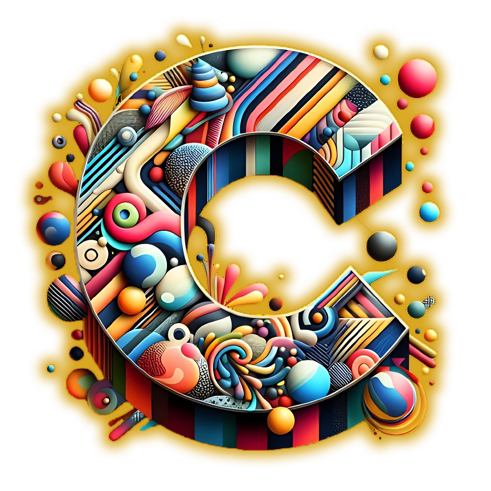

# CLAIRE

**Competency Learning Analytics for Insights and Reflection in Education**

CLAIRE is een dashboard dat helpt om leerdata inzichtelijk te maken. Het werd ontwikkeld als proof of concept (PoC) in samenwerking met **KU Leuven**, **GITO Overijse** en **Eummena**.

Jonas Van Hove ontwierp dit dashboard als onderdeel van zijn masterthesis  
_"Turning Learning Data into Meaningful Learning Analytics Dashboards"_ (2025).  
Later werkte hij samen met Eummena om het verder uit te bouwen.

Met veel zorg gemaakt, in de hoop dat CLAIRE een waardevolle basis vormt voor toekomstige dashboards binnen GITO en daarbuiten.
